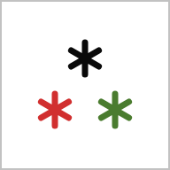
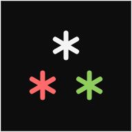
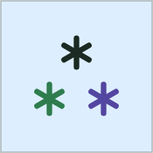
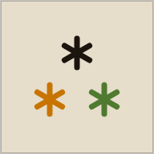
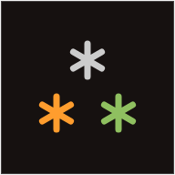
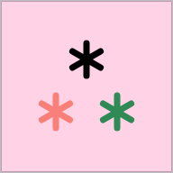
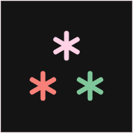
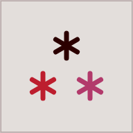
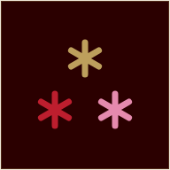
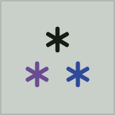

# /kalendes

A timeline view for your iCal feeds.

- **Project page** — https://heracl.es/kalendes
- **Live instance** — https://kalendes.vercel.app

*Kalendes* (Greek καλένδες, from Latin *Kalendae*) were the first day of each month in the Roman calendar — the day the month's days were called out and debts logged in the *kalendarium*, the account-book that gives us the word "calendar," fell due. The Greeks kept no Kalends of their own, so *at the Greek Kalendes* — Latin *ad Kalendas Graecas*, Greek *στις ελληνικές καλένδες* — became a byword for **never**, a date that never comes.

## What it does

Shows your calendars side-by-side as horizontal rows along a continuous timeline. Pinch-zoom from a single month out to two years, or drop into a **1-week hour grid** (1W) for a Google-Calendar-style day-by-day view across two timezones. Built for spotting overlap and travel across multiple feeds at once. Black-on-paper, e-ink friendly. Reads any ICS feed (Google, iCloud, Outlook, Fastmail, Nextcloud).

## How it works

`/kalendes` is a static Svelte 5 + Vite app. It pulls iCal feeds through a tiny Vercel proxy (sandboxed CORS, cache-friendly), parses them with `ical.js`, and renders pills with a custom lane-assignment layout. Find-and-replace rules let you rename, recolour, and filter events. Each calendar carries a type (None / Events / Holidays / Observances / Announcements / Guests) and an optional travel tag (international or local). Settings, feeds, and rules live in `localStorage` and move between devices via [share links](#share-links) or the paste-config flow. Calendars can also be imported from `.ics` files into local, editable lanes (see [Import & export](#import--export)). Offline-first: a service worker caches the shell and the last good feed responses. Events are cached locally for instant display on load, with background refresh.

## Week view (1W)

The **1W** toolbar button (left of the zoom row) switches into a week grid: days as columns, hours down the side, all feeds merged onto one surface. It sits outside the pinch/wheel zoom progression and is toggled on its own — tap **1W** again to return to the previous zoom, or **double-tap** it to clear the day marker and jump back to today.

- **Two timezones side-by-side** — the frozen left gutter shows the hour axis for the two zones set in Settings (top/bottom), plus your local zone when it differs. Country codes label each in the header corner, and the live local time rides the now-line.
- **Day/night shading** — the working-hours window (Time & date → morning/evening limits) is drawn per zone: the page colour marks where *both* zones are working (the overlap), a light tint where one is off, a darker tint where both are off. Dashed lines mark each zone's morning/evening edges; sun/moon glyphs sit in the gutter.
- **The day marker is shared across zooms** — set it by clicking a date header (in any view); switching between the timeline and 1W keeps it in view.
- **Navigation & editing** — arrow keys move a focus ring between events and days (Enter opens, Space selects); click an empty slot to draft a new event at that time; double-click an event to copy its details; a mouse hover shows a crosshair with the exact time. Pinch or Ctrl/⌘-scroll changes the row height. Horizontal scroll is bounded by the past/future-months setting.

## Event details

Tapping any event opens a detail card: its title, the date with the localized weekday (a single day inline, a multi-day span on its own row), start/end times and duration, location, and description. Side arrows down each edge page prev/next through that calendar's events without leaving the card, and a **{ }** toggle reveals the raw iCal with any matching find-and-replace rules highlighted in the rule's own style. Draft and imported events gain an **Edit** button; every event can be downloaded as `.ics` or copied. A quick mouse-hover shows the same summary as a lightweight preview.

## Events tray

The status bar along the bottom (or the left edge, per the Tray setting) doubles as the agenda view. Long-press an event — or press **Space** on a keyboard-focused one — to start selecting; selected events collect in the tray as structured rows that can be copied out as a TSV table or downloaded as `.ics`, and events living in local lanes can be moved, copied, or deleted across lanes from there.

## Keyboard shortcuts

| Keys | Action |
| --- | --- |
| <kbd>Ctrl</kbd>/<kbd>⌘</kbd> <kbd>/</kbd> | Toggle search — focuses the query field; <kbd>Enter</kbd> there jumps to the first upcoming match |
| <kbd>Ctrl</kbd>/<kbd>⌘</kbd> <kbd>,</kbd> | Open/close settings |
| <kbd>1</kbd>–<kbd>5</kbd> | Zoom to 1M / 3M / 6M / 1Y / 2Y, keeping the current center |
| <kbd>.</kbd> | Switch to the 1W week view |
| <kbd>0</kbd> | Jump to today |
| <kbd>←</kbd> <kbd>→</kbd> | Move the focus ring to the previous/next event in the lane; in 1W, to the adjacent day. With the event card open, page prev/next — stepping through the days of a multi-day span first |
| <kbd>↑</kbd> <kbd>↓</kbd> | Jump to the adjacent calendar lane, landing on the nearest-in-time event; in 1W, move within the day. With the event card open, go straight to the previous/next event |
| <kbd>Space</kbd> | Select/deselect the focused event into the [tray](#events-tray); with nothing focused, toggle the 1W week view and back |
| <kbd>Enter</kbd> | Open the focused event in 1W; otherwise jump to today. Dialogs hand focus to their primary action — COPY on the event card, Save in the event editor — so <kbd>Enter</kbd> triggers that |
| <kbd>Esc</kbd> | Close the topmost layer — dialog, event card, settings, search — then clear the selection or the 1W focus ring |

Bare-key shortcuts stay out of the way while typing in a text field; <kbd>Ctrl</kbd>/<kbd>⌘</kbd> combos and <kbd>Esc</kbd> work everywhere.

## Settings

- **Look & feel** — [flavor and scheme](#themes--flavors), spacing, tray side, font size, border weight, motion, and haptics
- **Time & date** — language, date and time formats, the two timezones shown side-by-side in the 1W week view, a DST override, past/future months visible (also bounds how far the 1W week view scrolls), and morning/evening limits (hide timed events outside a chosen hour range, and drive the 1W day/night shading)
- **Event filters** — find & replace rules: rename, recolour, or hide events by keyword
- **Calendars** — add, reorder, and configure ICS feeds. You can also paste a Google Calendar **share** or **embed** link (e.g. `https://calendar.google.com/calendar/embed?src=…`) and it's converted to that calendar's ICS feed automatically — the calendar must be shared publicly, otherwise Google returns a 404 and the feed shows an error explaining how to enable public sharing.
- **Refresh interval** — 30 min / 1 h / 4 h

## Themes & flavors

Appearance is two independent axes: a **flavor** (the colour palette) and a **scheme** (Auto / Light / Dark — Auto follows the system). Each flavor defines four tokens, in a light and a dark variant: `--paper-color` (the page), `--ink-color` (text and lines), `--accent-color`, and `--link-color`; every other colour in the UI derives from those. Each flavor pairs its accent with a contrasting link colour — often another part of the namesake plant (pepper's red with a pimento green, juniper's green needle with a blue-violet berry), sometimes just a complementary hue (sage's violet flower with a deep blue, cinnamon's brick red with a deep pink). Links rest at the ink colour and reveal `--link-color` on hover/active/focus. In the swatches below the square is the paper and the ⁂ stars are the ink, accent, and link colours. Each swatch links to its SVG source in [`docs/flavors/`](docs/flavors), where the shapes carry the token names as ids.

| Flavor | Light | Dark |
| --- | --- | --- |
| **Pepper** (default) |  |  |
| **Juniper** |  |  |
| **Bergamot** |  |  |
| **Rose** |  |  |
| **Cinnamon** |  |  |
| **Sage** |  |  |

## Import & export

The Configuration section's **Import** button (and long-press to paste from the clipboard) accepts two kinds of input, auto-detected from the content:

- **A JSON config** — the format produced by **Export** — replaces your current calendars, rules, and settings. Use it to move a full setup between devices, alongside [share links](#share-links).
- **An `.ics` calendar file** — adds its events as a new **local lane**, named after the calendar (`X-WR-CALNAME`), the file, or the import date. A local lane behaves like the built-in **Draft**: its events are editable, stored in `localStorage`, and not synced to any URL. Recurring events are expanded to a static snapshot within the visible window at import time; no link to the source file is kept. Each `.ics` you import becomes its own lane, and any imported lane can be deleted.

In **Calendars**, each row carries a marker that distinguishes local lanes (Draft and imported `.ics`) from URL-backed feeds: an **unlink** glyph for local, not-synced lanes and a **link** glyph for linked URL feeds. Each local lane can be exported back to an `.ics` file from its row.

## Share links

The **Share** button in Settings → Configuration copies a link (or opens the native share sheet) that carries the whole setup in the URL itself — nothing is uploaded anywhere: the linked calendars with their names, types, travel tags, and timezones; the find-and-replace rules; a snapshot of the current view (zoom, language, date format, scheme, flavor); and the kiosk PIN if one is set. Local lanes (Draft and imported `.ics`) are not included — they exist only in your browser. The payload is deflate-compressed into a `?s=` parameter; if the setup grows past the ~2000-character URL limit the button disables and says so. The date being viewed rides along in the `#` fragment, so a link also works as a plain "look at this date" pointer even without importing.

Opening a share link brings up the **Import shared setup** prompt, stating how many calendars and rules it carries, with three choices:

- **Replace yours** — swap your calendars and rules for the shared ones.
- **Merge** — keep everything you have and add only the shared calendars (by URL) and rules you don't already have.
- **Cancel** — dismiss; nothing is imported.

Either import also applies the shared view settings, and a link carrying a kiosk PIN locks the app on arrival (see [Kiosk mode](#kiosk-mode)).

## Kiosk mode

For wall displays and shared screens. Long-press the gear icon (~3s) to set a 4-digit PIN; the icon becomes a padlock and the app locks into a read-only view — settings, calendar/filter editing, the events tray, and all downloads/exports are disabled, while browsing, search, and collapsing/expanding calendar rows still work. Long-press the padlock (~3s) to bring up the unlock modal; the correct PIN clears the lock. The PIN survives reloads (so the screen stays locked), and the **Share** button produces a [share link](#share-links) that, when opened, prompts to import the setup and then lands locked.

## Developer & testing

The **Reset** button in Settings → Configuration normally takes two taps to reset everything to defaults. It also carries a hidden developer shortcut: **long-press it (~3s)** to reset to defaults *and* seed a demo dataset — a **Draft** lane of varied sample events (past/future all-day spans, timed meetings around today, overlaps across categories) plus a second imported test lane — then reload. A confirm dialog guards it, since it replaces your current calendars, rules, and settings. Handy for exercising the timeline, the 1W week grid, and the layout code without wiring up real feeds.

## Credit

Dialectic Acheiropoieton of Heracles Papatheodorou and Claude.

MIT License.
